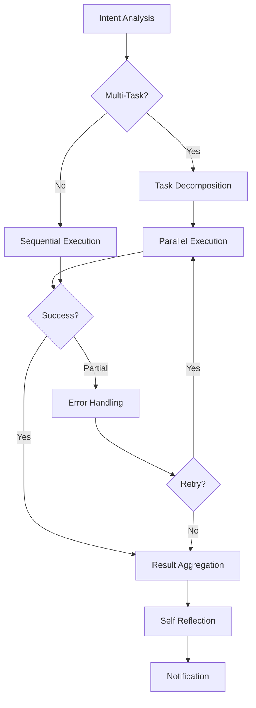

# LangGraph 기반 Agentic AI 시스템

## 🚀 개요

Discord 메시지를 Multi-Agent System으로 처리하는 비선형 워크플로우 시스템입니다.

### 주요 특징

- **비선형 워크플로우**: LangGraph 기반 복잡한 의사결정 트리
- **Multi-Agent System**: 전문화된 에이전트들의 협업
- **Self-Reflection**: 성능 분석 및 자동 개선
- **병렬 처리**: 독립적 작업의 동시 실행
- **에러 복구**: 자동 재시도 및 부분 실패 처리

## 🏗️ 아키텍처

```
langgraph_agents/
├── agents/              # 개별 에이전트
│   ├── base_agent.py   # 베이스 에이전트 클래스
│   ├── intent_router.py # 의도 분석 에이전트
│   ├── task_decomposer.py # 작업 분해 에이전트
│   └── reflection_agent.py # Self-reflection 에이전트
├── workflows/           # LangGraph 워크플로우
│   └── graph_definition.py # 그래프 정의
├── state/              # 상태 관리
│   ├── models.py       # 데이터 모델
│   └── manager.py      # 상태 매니저
├── services/           # 외부 서비스 연동
│   ├── notion_service.py
│   ├── discord_service.py
│   └── ...
├── utils/              # 유틸리티
│   └── helpers.py
└── main.py            # 메인 실행 파일
```

## 🤖 Agent 구성

### 1. IntentRouterAgent
- 사용자 메시지 분석
- 의도 분류 및 작업 유형 결정
- 우선순위 및 의존성 파악

### 2. TaskDecomposerAgent
- 복합 작업을 단위 작업으로 분해
- 병렬 실행 그룹 생성
- 의존성 그래프 구축

### 3. ExecutionAgents
- **NotionAgent**: Notion 작업 처리
- **DiscordAgent**: Discord 메시지 및 URL 요약
- **CalendarAgent**: Google Calendar 일정 관리 (추후 구현)
- **GmailAgent**: Gmail 이메일 발송 (추후 구현)

### 4. SelfReflectionAgent
- 세션 성능 분석
- 시스템 메트릭 모니터링
- 개선 제안 생성

## 🔄 워크플로우



## 🛠️ 설치 및 실행

### 1. 의존성 설치
```bash
pip install -r requirements.txt
```

### 2. 환경변수 설정
`.env` 파일을 생성하고 다음 변수들을 설정:

```env
# Discord 설정
DISCORD_TOKEN=your_discord_bot_token
DISCORD_CHANNEL_ID=your_target_channel_id

# Gemini AI 설정
GEMINI_API_KEY=your_gemini_api_key

# Notion 설정
NOTION_API_KEY=your_notion_integration_token
NOTION_DATABASE_ID=your_notion_database_id

# 시스템 설정
LOG_LEVEL=INFO
MAX_RETRY_ATTEMPTS=3
PARALLEL_EXECUTION_LIMIT=5
```

### 3. 실행
```bash
python main.py
```

## 📝 사용 예시

### 단순 작업
```
"프로젝트 진행상황을 노션에 정리해줘"
→ NotionAgent가 직접 처리
```

### 복합 작업
```
"내일 회의 일정 잡고 참석자들에게 메일 보내줘"
→ 1. CalendarAgent: 일정 등록
→ 2. GmailAgent: 메일 발송 (일정 등록 완료 후)
```

### URL 요약
```
"https://youtube.com/watch?v=123 이거 요약해줘"
→ DiscordAgent가 URL 내용을 분석하고 요약 제공
```

## 📊 모니터링

### 성능 메트릭
- 에이전트별 성공률
- 평균 실행 시간
- 재시도 횟수
- 세션 완료율

### Self-Reflection 기능
- 실시간 성능 분석
- 자동 개선 제안
- 학습 데이터 수집

## 🔧 확장 가능성

### 새로운 Agent 추가
1. `BaseAgent`를 상속하는 새 클래스 생성
2. `main.py`에서 agent 등록
3. `intent_router.py`에 새 작업 유형 추가

### 새로운 서비스 연동
1. `services/` 디렉토리에 새 서비스 모듈 추가
2. `TaskType` enum에 새 타입 추가
3. 라우팅 로직 업데이트

## 🚧 향후 개발 계획

- [ ] Google Calendar Agent 구현
- [ ] Gmail Agent 구현
- [ ] 웹 인터페이스 추가
- [ ] 실시간 모니터링 대시보드
- [ ] ML 기반 성능 최적화
- [ ] 다중 사용자 지원

## 🤝 기여하기

1. Fork 프로젝트
2. Feature 브랜치 생성
3. 변경사항 커밋
4. Pull Request 생성

## 📄 라이선스

MIT License